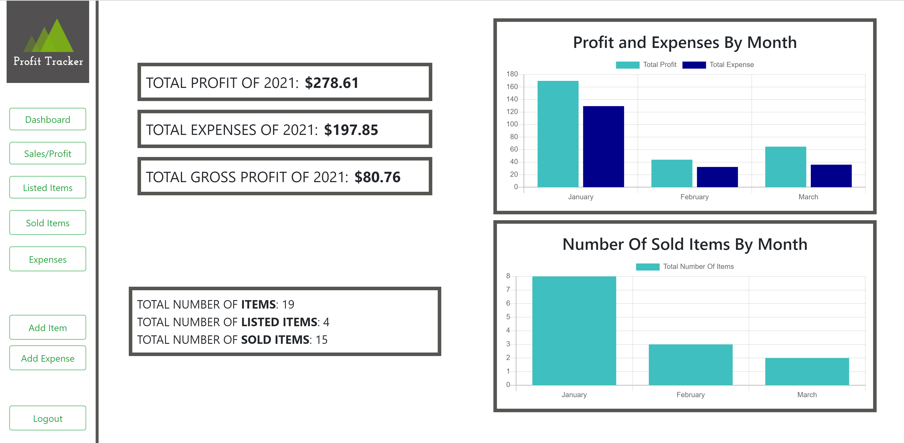
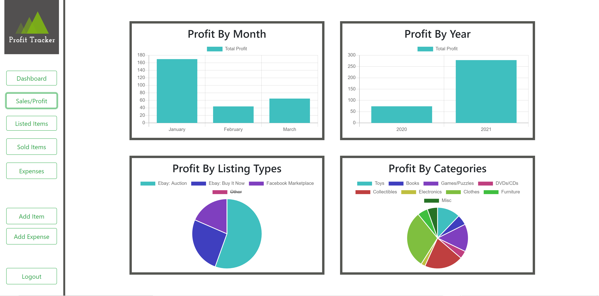
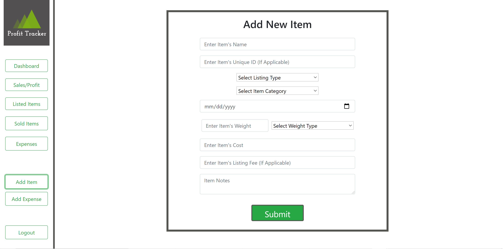
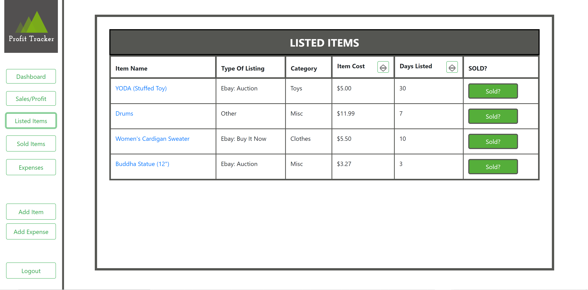
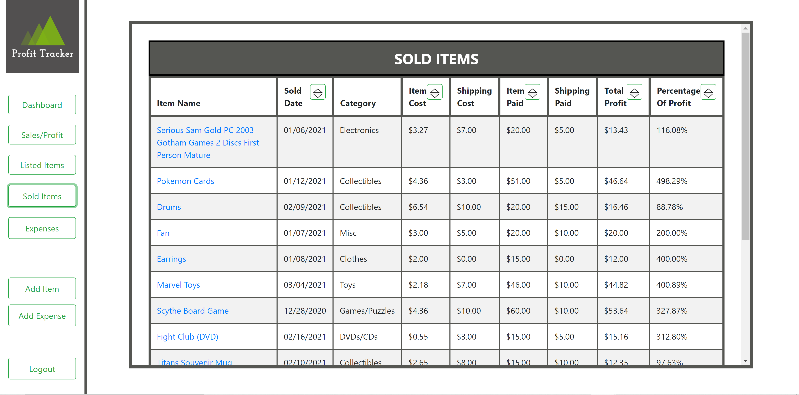
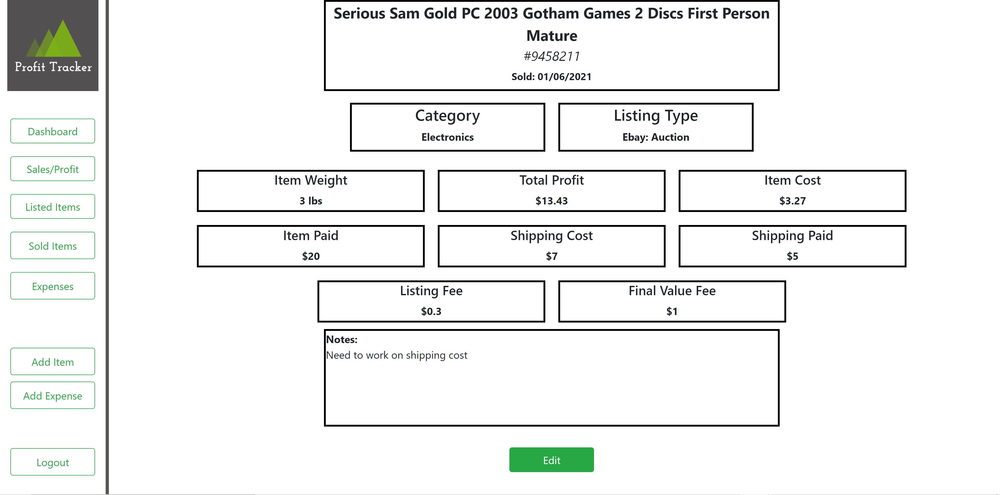
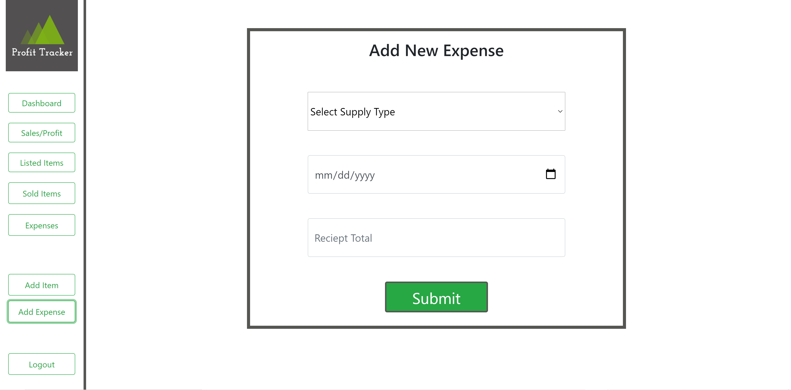
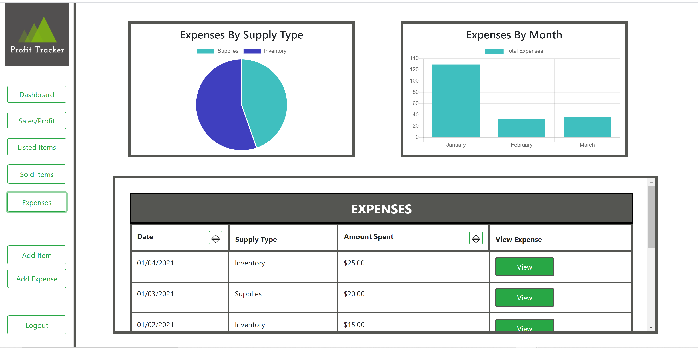

# PROFIT TRACKER
> Profit/Expense tracking website for the small business owner

The server repo can be found here: [https://github.com/mswinkels09/finalcapstone](https://github.com/mswinkels09/finalcapstone)

## The Idea
With Covid 19 happening all around us, we wanted a way to make a little extra income while still being as safe as possible. My boyfriend fell back on selling used items on ebay and facebook marketplace. After some success, and some great finds at local thrift stores, this side business has now turned into a passion.  
I wanted to create this application to be able to not only organize all of the items that were listed and sold. But also create a place to easily see how much profit my boyfriend was making and how that compared to the amount of money he spent on inventory and shipping supplies. The goal was to be able to determine if this passion can turn into a full time business.

## Features
- Easily see your total profit, total expenses, and gross profit from the current year
- Automatically graphs your total sales and expenses.
- Seperates Profit and Expenses into categories such as:  
      -<strong> Profit:</strong> 
            > listing type (Ebay: Auction, Ebay: Buy It Now,  Facebook Marketplace, Other) 
            > item categories (books, toys, collectibles, clothes, books, etc) 
      - <strong> Expenses:</strong>  
            > supply type (Supplies, Inventory) 
- Full CRUD capability on all items that are currently listed
- Easy accessible sold button for convenience when item is sold
- List and Edit features for all sold items 
- Full CRUD capability on expenses
- Sort each table by a multitude of factors

## PICS
            
           
 

## Installing locally

This app was created with create-react-app.
Dependencies: npm

1. Clone the repo: [https://github.com/mswinkels09/finalcapstoneclient](https://github.com/mswinkels09/finalcapstoneclient)
1. Move into the the repo that you just created `cd finalcapstoneclient`
1. Run `npm install`
1. Run `npm start`
1. Note that the client will now be running locally, but it will make requests to the "production" server. If you want to make requests to a local server, change the path variable in `src/ServerPath.js`

## KUDOS
 - I want to thank my entire class in NSS Cohort 42, everyone was so supported and pushed me to become a better software developer.
 - Special thanks to the Trunch Bunch, Bryan Ford, Chris Johnson and Dylan Rowe You guys helped me out of sticky situations either in code or mentally and can't thank you enough!
 - I want to give a very warm thank you to my boyfriend, Mike, and my friends Alyssa Nycum and Kirren Covey for their words of wisdom, telling me over and over that I can accomplish what I set out to do and of course answering my coding questions when I got stuck.
 - Last but not least I want to thank our entire NSS Cohort 42 staff. Steve Brownlee, Mo Silvera, Jack Parsons you guys especially helped me through these past couple months and have always been willing to help!
 THANK YOU!!
 
 
